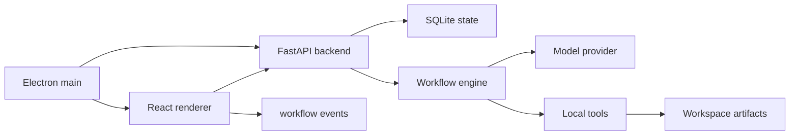

# Architecture

## Observed target pattern

The reference product installed on this machine uses this broad structure:

- Electron desktop app
- Python backend on localhost
- FastAPI, uvicorn, websocket, SQLite
- bundled runtimes for Python, Node, Git, and TeX
- workflow templates for research and contests
- skill directories and LaTeX templates
- artifact workspace with code, figures, paper, logs, and reports

This project follows the same product architecture without copying implementation.

## System diagram

## Core backend modules

- `app.main`: API surface and startup.
- `app.db`: SQLite schema and state helpers.
- `app.services.llm`: OpenAI-compatible provider plus local fallback.
- `app.services.workflow_engine`: staged workflow runner.
- `app.services.artifacts`: workspace file creation.
- `app.workflows.templates`: contest and research workflow definitions.

## Workflow state

Workflows move through:

- `draft`
- `running`
- `waiting`
- `completed`
- `failed`

Steps move through:

- `pending`
- `running`
- `waiting`
- `completed`
- `failed`

Checkpoint steps pause the workflow after generating an artifact. The user can approve
and continue from the UI.

## Product-specific modules to add next

- file upload and problem extraction
- document preview for PDF, DOCX, XLSX
- Python code execution with approval
- LaTeX editor and compiler log viewer
- artifact export as zip
- multi-model reviewer loop
- visual model/image understanding
- packaged runtimes and installer

